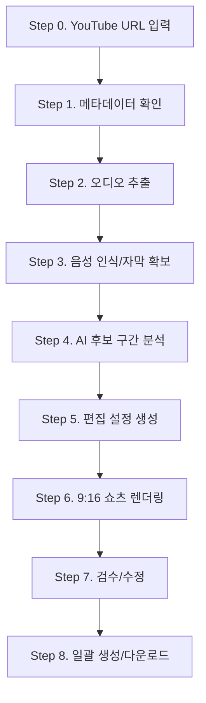

# 구체적 프로젝트 워크플로우

이 프로젝트는 영상에서 소개된 `YouTube 주소 입력 → 롱폼 분석 → 쇼츠 자동 후보 생성 → 편집 → MP4 다운로드` 도구를 단계적으로 구현한다. 첫 목표는 큰 웹 서비스가 아니라, 로컬에서 검증 가능한 제작 파이프라인을 만드는 것이다.

## 전체 단계



## Step 0. YouTube URL 입력

목표:

- 작업할 YouTube 주소를 입력한다.
- 영상 제목, 채널, 길이, 자막 가능 여부를 확인한다.

입력:

- YouTube URL

산출물:

- 프로젝트 작업 폴더
- `youtube-info.json`

우선 구현:

- 로컬 CLI에서 YouTube URL을 받는다.
- `yt-dlp`로 제목, 채널, 길이, 자막 목록을 확인한다.

실행 명령:

```bash
python3 -m clipper_pipeline youtube-info \
  --url "https://www.youtube.com/watch?v=WZBMyztg2ts" \
  --out runs/youtube-WZBMyztg2ts/youtube-info.json \
  --failure-out runs/youtube-WZBMyztg2ts/failure-state.json
```

실패 처리:

- 실패 시 진행 화면에는 실패 상태만 표시한다.
- 사용자 선택지는 `처음으로`와 `다시 실행` 두 개만 제공한다.
- `처음으로`는 URL 입력 화면인 `url_input`으로 이동한다.
- `다시 실행`은 실패한 같은 명령과 인자를 다시 실행한다.

## Step 1. 영상 인입

목표:

- YouTube 영상을 프로젝트 작업 폴더에 등록한다.
- 분석과 렌더링에 필요한 메타데이터를 저장한다.

산출물:

- `input.mp4`
- `metadata.json`

구현 항목:

- YouTube 다운로드
- 로컬 영상 존재 여부 확인
- 길이/해상도/프레임레이트 추출
- 지원 확장자 검증

실행 명령:

```bash
python3 -m clipper_pipeline download-youtube \
  --url "https://www.youtube.com/watch?v=WZBMyztg2ts" \
  --out runs/youtube-WZBMyztg2ts/input.mp4 \
  --max-height 720 \
  --failure-out runs/youtube-WZBMyztg2ts/failure-state.json

python3 -m clipper_pipeline probe \
  --input runs/youtube-WZBMyztg2ts/input.mp4 \
  --out runs/youtube-WZBMyztg2ts/metadata.json
```

## Step 2. 오디오 추출

목표:

- 음성 인식에 쓸 오디오 파일을 만든다.

산출물:

- `audio.wav`

구현 항목:

- `ffmpeg`로 16kHz mono WAV 추출
- 실패 시 에러 메시지 저장

실행 명령:

```bash
python3 -m clipper_pipeline extract-audio \
  --input runs/youtube-WZBMyztg2ts/input.mp4 \
  --out runs/youtube-WZBMyztg2ts/audio.wav
```

## Step 3. 음성 인식/자막 확보

목표:

- 타임스탬프가 포함된 자막을 확보한다.

산출물:

- `transcript.json`
- `transcript.txt`

구현 항목:

- YouTube 자동 자막을 우선 가져온다.
- 자막이 없을 때 Whisper API 또는 local Whisper로 대체한다.

실행 명령:

```bash
python3 -m clipper_pipeline fetch-transcript \
  --url "https://www.youtube.com/watch?v=WZBMyztg2ts" \
  --out runs/youtube-WZBMyztg2ts/transcript.txt \
  --languages "ko,en" \
  --failure-out runs/youtube-WZBMyztg2ts/failure-state.json
```

## Step 4. AI 후보 구간 분석

목표:

- 자막을 분석해 쇼츠 후보 구간을 만든다.
- 영상에서 소개한 것처럼 최대 6개 후보를 기본값으로 한다.

산출물:

- `candidates.json`

후보 데이터:

- 시작 시간
- 끝 시간
- 길이
- 추천 제목
- 추천 이유
- 해시태그
- 점수

우선 구현:

- 자막 기반 휴리스틱 분석기를 먼저 만든다.
- 이후 LLM 분석기로 교체 가능하게 구조를 분리한다.
- 자막을 문장 단위로 우선 묶고, 자동 자막에 마침표가 부족할 때는 주제 전환 신호를 기준으로 45초 이하 블록으로 나눈다.
- 후보 점수는 많이 본 구간, 반전, 호기심, 문제 제기, 실제 증거, 이목 집중 단어, 영상 내 위치를 함께 반영한다.
- 6개는 최대 후보 수이며 약한 구간을 억지로 채우지 않는다. 단 YouTube heatmap의 최고 구간이 있으면 반드시 포함하고, heatmap이 없으면 후킹 점수 1위 후보를 `가장 많이 본 구간` 대체 후보로 표시한다.

## Step 5. 편집 설정 생성

목표:

- 후보 클립마다 타이틀, 채널명, 레이아웃, 자막 옵션을 저장한다.

산출물:

- `edit-config.json`

기본 설정:

- 캔버스: 1080x1920
- 레이아웃: `letterbox`
- 제목 위치: 상단 중앙
- 채널명 위치: 하단 중앙
- 세이프존: YouTube Shorts
- 3분할 가이드: 표시

실행 명령:

```bash
python3 -m clipper_pipeline init-edit \
  --candidate runs/youtube-WZBMyztg2ts/candidates.json \
  --index 0 \
  --channel "ZeroCho TV" \
  --out runs/youtube-WZBMyztg2ts/edit-config.json
```

## Step 6. 9:16 쇼츠 렌더링

목표:

- 선택한 후보를 MP4로 만든다.

산출물:

- `renders/clip-001.mp4`

구현 항목:

- 원본 구간 컷
- 레터박스 렌더링
- 세로 크롭 렌더링
- 제목 오버레이
- 채널명 오버레이
- 자막 오버레이

실행 명령:

```bash
python3 -m clipper_pipeline render \
  --input runs/youtube-WZBMyztg2ts/input.mp4 \
  --candidate runs/youtube-WZBMyztg2ts/candidates.json \
  --index 0 \
  --edit-config runs/youtube-WZBMyztg2ts/edit-config.json \
  --transcript runs/youtube-WZBMyztg2ts/transcript.txt \
  --out runs/youtube-WZBMyztg2ts/renders/clip-001.mp4
```

렌더링 방식:

- 현재 로컬 FFmpeg에는 `drawtext` 필터가 없어 텍스트를 직접 그릴 수 없다.
- 대신 Python/Pillow로 1080x1920 투명 PNG 텍스트/자막 레이어를 만든 뒤 FFmpeg `overlay` 필터로 합성한다.
- 이 방식은 FFmpeg 빌드 차이에 덜 민감하고, 브라우저 미리보기와 같은 좌표계를 유지하기 쉽다.
- 자막은 transcript 타임스탬프를 기준으로 문장별 PNG를 만들고, FFmpeg `overlay enable=between(...)` 조건으로 해당 시간에만 표시한다.
- `edit-config.json`의 `subtitleStyle`로 자막 폰트, 크기, 색상, 외곽선, 배경 박스, 최대 줄 수, 위치를 제어한다.
- 기본 타이틀/자막 폰트는 로컬에 설치된 `NEXON Lv1 Gothic`을 사용한다.
- 세로 크롭은 `cropConfig.focusX`, `cropConfig.focusY`, `cropConfig.zoom`을 사용해 수동 초점과 확대율을 조정한다.
- `cropConfig.trackingMode`와 `speakerTrackingEnabled`, `faceTrackingEnabled`는 다음 단계의 자동 화자/얼굴 추적 연결 지점으로 둔다.

## Step 7. 검수/수정

목표:

- AI가 잡은 구간과 배치를 사람이 조정한다.

수정 항목:

- 시작점/끝점
- 1초 단위 앞뒤 이동
- 제목 문구
- 제목 위치
- 폰트/색상
- 채널명
- 레이아웃
- 자막 표시 여부

## Step 8. 일괄 생성/다운로드

목표:

- 선택한 후보 여러 개를 한 번에 생성한다.

산출물:

- 여러 개의 MP4 파일
- 업로드용 제목/해시태그 목록

실행 명령:

```bash
python3 -m clipper_pipeline render-all \
  --input runs/youtube-WZBMyztg2ts/input.mp4 \
  --candidate runs/youtube-WZBMyztg2ts/candidates.json \
  --out-dir runs/youtube-WZBMyztg2ts/batch-renders \
  --edit-config-dir runs/youtube-WZBMyztg2ts/batch-edit-configs \
  --manifest runs/youtube-WZBMyztg2ts/render-manifest.json \
  --channel "ZeroCho TV" \
  --layout letterbox \
  --transcript runs/youtube-WZBMyztg2ts/transcript.txt
```

## Step 9. 렌더 결과물 자동 검수

목표:

- 렌더된 MP4가 업로드 가능한 기본 품질을 만족하는지 자동으로 확인한다.

검수 항목:

- 영상 스트림 존재 여부
- 오디오 스트림 존재 여부
- 1080x1920 해상도
- 영상 길이
- `yuv420p` 픽셀 포맷
- 샘플 프레임의 검은 화면 비율
- 타이틀/채널명 텍스트의 캔버스 이탈 여부
- 텍스트 레이어 간 겹침 가능성

실행 명령:

```bash
python3 -m clipper_pipeline validate-render \
  --input runs/youtube-WZBMyztg2ts/renders/clip-002-crop-right.mp4 \
  --edit-config runs/youtube-WZBMyztg2ts/edit-config-crop.json \
  --out runs/youtube-WZBMyztg2ts/validation-crop-right.json
```

## 지금 시작하는 범위

현재 바로 시작한 것은 Phase 1이다.

1. 자막 파일을 읽는다.
2. 후보 구간을 최대 6개 생성한다.
3. 후보 JSON을 저장한다.
4. 향후 영상 파일이 들어오면 같은 구조에서 MP4 렌더링까지 이어간다.

실행 명령:

```bash
python3 -m clipper_pipeline analyze \
  --transcript runs/youtube-WZBMyztg2ts/transcript.txt \
  --out runs/youtube-WZBMyztg2ts/candidates.json
```

다음 실행 명령:

```bash
python3 -m clipper_pipeline render \
  --input runs/youtube-WZBMyztg2ts/input.mp4 \
  --candidate runs/youtube-WZBMyztg2ts/candidates.json \
  --index 0 \
  --edit-config runs/youtube-WZBMyztg2ts/edit-config.json \
  --transcript runs/youtube-WZBMyztg2ts/transcript.txt \
  --out runs/youtube-WZBMyztg2ts/renders/clip-001.mp4
```
