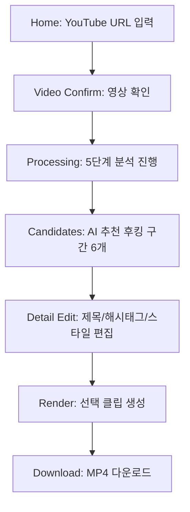

# UI 기능 구현 설명서

스크린캡처 7장을 기준으로 확인한 기능과 UI를 구현 단위로 정리한다. 이 문서는 웹 편집기 구현 전에 화면 구조, 상태, 데이터, 인터랙션, 검수 기준을 맞추기 위한 기준 문서다.

## 1. 전체 사용자 흐름



## 2. Home 화면

### 확인된 UI

- 검은색 다크 테마
- 중앙 상단 헤드라인: `YouTube URL을 붙여넣으세요`
- 보조 문구: `AI가 자동으로 후킹 구간을 찾아 쇼츠로 만들어줍니다`
- URL 입력창
- 파란색 CTA 버튼: `쇼츠 만들기`
- `이전 프로젝트` 목록
- 프로젝트 카드
  - 제목
  - 상태 배지: `분석 완료`, `완료`
  - 영상 길이
  - 날짜
  - 삭제 아이콘

### 구현 기능

- YouTube URL 입력
- URL 형식 검증
- 엔터 또는 버튼으로 영상 확인 단계 진입
- 이전 프로젝트 목록 조회
- 프로젝트 카드 클릭 시 기존 분석 결과 복원
- 프로젝트 삭제

### 상태

- idle
- invalid_url
- loading_metadata
- metadata_loaded
- error

### 데이터

```json
{
  "url": "https://www.youtube.com/watch?v=...",
  "projects": [
    {
      "id": "project-id",
      "title": "유튜브 롱폼 100개 챌린지 도전!!",
      "status": "completed",
      "durationSec": 600,
      "createdAt": "2026-04-28"
    }
  ]
}
```

### 검수 기준

- 비어 있는 URL이면 `쇼츠 만들기` 버튼 비활성화
- YouTube URL이 아니면 오류 메시지 표시
- 이전 프로젝트는 최신순으로 표시
- 삭제 클릭 시 즉시 삭제하지 않고 확인 절차를 둔다

## 3. 영상 확인 화면

### 확인된 UI

- URL 입력 후 영상 확인 카드가 중앙에 표시된다.
- YouTube 임베드/썸네일 영역
- 영상 제목: `유튜브 롱폼 100개 챌린지 도전!! (20/100)`
- 채널명/작성자 정보
- 안내 문구: `이 영상이 맞나요? 분석을 시작하면 다운로드 후 자동으로 진행됩니다.`
- 주요 버튼
  - 파란색: `맞아요, 분석 시작`
  - 회색: `다른 영상`

### 구현 기능

- YouTube 메타데이터 로딩
- 썸네일 또는 임베드 미리보기
- 영상 제목/채널명/길이 표시
- 분석 시작
- URL 재입력으로 돌아가기

### 상태

- metadata_loading
- metadata_success
- metadata_failed
- confirm_ready
- starting_analysis

### API

- `POST /api/projects/preview`
  - input: URL
  - output: title, channel, duration, thumbnail, embedUrl
- `POST /api/projects`
  - input: URL
  - output: projectId

### 검수 기준

- 영상 제목과 채널명이 YouTube 메타데이터와 일치해야 한다.
- `다른 영상` 클릭 시 URL 입력 화면으로 돌아가며 기존 입력값은 유지한다.
- 분석 시작 후 중복 클릭을 막는다.

## 4. 처리 진행 화면

### 확인된 UI

5단계 작업 상태가 세로로 표시된다.

1. 영상 다운로드
2. 오디오 추출
3. 음성 인식
4. AI 분석
5. 클립 생성

각 단계는 다음 상태를 가진다.

- 완료: 체크 아이콘
- 진행 중: 로딩 스피너와 파란 진행 바
- 대기: 회색 점

진행 중인 단계에는 퍼센트가 표시된다. 예: `3.4%`, `50%`

### 구현 기능

- 작업 큐 상태 구독
- 단계별 진행률 표시
- 완료/진행/대기 상태 표시
- 실패 시 오류 메시지만 표시
- 실패 화면 액션은 `처음으로`와 `다시 실행`만 제공
- `처음으로`는 URL 입력 화면으로 이동
- `다시 실행`은 실패한 동일 단계와 동일 인자를 재실행

### 현재 프로토타입

- 위치: `web/index.html`
- 구현 범위: URL 입력, 처리 상태, 실패 화면, 재시도/초기화 액션
- 정상 URL은 처리 단계를 거쳐 후보 생성 진입 카드로 이동한다.
- 잘못된 URL은 다운로드 단계 실패로 표시하고 `처음으로`와 `다시 실행` 버튼만 노출한다.
- 실행 서버: `python3 -m clipper_pipeline.server --host 127.0.0.1 --port 8787`
- 접속 URL: `http://127.0.0.1:8787`
- 작업 시작 API: `POST /api/jobs`
- 작업 상태 API: `GET /api/jobs/{id}`
- 작업 완료 응답: `result.clips`
- 완료 화면은 후보 카드 리스트, 선택/해제, 전체 선택/전체 해제를 제공한다.
- 후보 본문 클릭 시 상세 편집 패널이 열린다.
- 후보 체크 버튼은 선택/해제만 담당한다.
- 상세 패널은 좌측 9:16 영상 미리보기와 우측 기능 패널로 구성한다.
- 좌측 미리보기는 활성 후보의 원본 구간 또는 재렌더 결과를 보여준다.
- 우측 기능 패널은 제목, 해시태그, 레이아웃, 자막 크기, 자막 위치를 편집한다.
- `선택된 클립 생성`은 `POST /api/jobs/{id}/render-selected`를 호출한다.
- 서버는 선택 후보별 edit-config를 `runs/{videoId}/web-edit-configs/`에 저장한다.
- 최종 MP4와 업로드용 JSON 메타데이터는 `/Users/noahai/Desktop/randers-clips/YYYY-MM-DD/`에 저장한다.
- 날짜 폴더의 `upload-manifest-*.json`은 자동 업로드 에이전트가 읽을 수 있도록 제목, 날짜, 해시태그, 원본 URL, 클립 경로를 포함한다.

### 상태 모델

```json
{
  "projectId": "project-id",
  "currentStep": "ai_analysis",
  "steps": [
    { "key": "download", "label": "영상 다운로드", "status": "done", "progress": 100 },
    { "key": "extract_audio", "label": "오디오 추출", "status": "done", "progress": 100 },
    { "key": "transcribe", "label": "음성 인식", "status": "running", "progress": 3.4 },
    { "key": "ai_analysis", "label": "AI 분석", "status": "pending", "progress": 0 },
    { "key": "clip_generation", "label": "클립 생성", "status": "pending", "progress": 0 }
  ]
}
```

### 구현 메모

- 현재 CLI 명령과 매핑:
  - 영상 다운로드: `download-youtube`
  - 오디오 추출: `extract-audio`
  - 음성 인식: `fetch-transcript` 또는 Whisper
  - AI 분석: `analyze`
  - 클립 생성: `init-edit` 또는 후보 편집 설정 생성

### 검수 기준

- 완료된 단계는 다시 진행 상태로 돌아가지 않는다.
- 진행률이 없는 작업도 단계 상태는 명확히 보여야 한다.
- 실패 단계와 실패 원인을 저장한다.

## 5. AI 추천 후킹 구간 화면

### 확인된 UI

- 섹션 제목: `AI 추천 후킹 구간 (6개)`
- 버튼: `전체 선택`, `전체 해제`
- 우측 상단 CTA: `선택된 6개 클립 생성`
- 가로 스크롤 카드 캐러셀
- 좌우 네비게이션 화살표
- 페이지/슬라이드 인디케이터
- 후보 카드
  - 번호: `#1`, `#2`
  - 체크박스
  - 제목
  - 세로 쇼츠 미리보기
  - 신뢰도/점수 배지: `95%`, `93%`, `92%`, `90%`
  - 길이: `58초`, `90초`, `65초`
  - 카드 하단 제목
  - 시작~끝 시간
- 선택된 카드는 파란 테두리로 강조된다.

### 구현 기능

- 후보 카드 목록 표시
- 후보 선택/해제
- 전체 선택/해제
- 선택 후보 개수 계산
- 선택 후보 일괄 생성
- 후보 클릭 시 상세 편집 패널 갱신
- 가로 스크롤/페이지 이동

### 후보 데이터

```json
{
  "id": "clip-001",
  "index": 1,
  "title": "100개 채널 키운 전문가의 고백",
  "reason": "강력한 역설적 오프닝...",
  "startSec": 0,
  "endSec": 58,
  "durationSec": 58,
  "confidence": 0.95,
  "selected": true,
  "thumbnailTimeSec": 3,
  "hashtags": ["#유튜브컨설턴트", "#채널운영"]
}
```

### 검수 기준

- 기본 후보 수는 6개
- 선택 후보가 0개면 생성 버튼 비활성화
- 카드 제목은 2~3줄 안에서 잘려야 한다
- 후보 점수는 백분율로 표시
- 가로 스크롤 바가 있어도 핵심 컨트롤이 가려지지 않아야 한다

## 6. 상세 편집 영역

### 확인된 UI

- 섹션 제목: `#1 상세 편집`
- 후보 선정 이유 설명
- 입력 필드: `영상 제목 (상단에 표시됨)`
- 추천 해시태그 칩 목록
  - 칩 삭제 `x`
- 태그 입력창: `#태그입력`
- `추가` 버튼

### 구현 기능

- 후보 제목 수정
- 추천 해시태그 표시
- 해시태그 추가
- 해시태그 삭제
- 선정 이유 표시
- 편집 내용 자동 저장 또는 수동 저장

### 검수 기준

- 해시태그는 `#` 없이 입력해도 자동 보정
- 중복 태그는 추가하지 않는다
- 제목이 비어 있으면 저장/렌더링을 막는다
- 수정된 제목은 미리보기와 후보 카드에 즉시 반영

## 7. 9:16 미리보기 패널

### 확인된 UI

- 좌측에 `9:16 미리보기` 영역
- 탭/토글:
  - `가이드`
  - `세이프`
  - `음성`
  - `심플론` 또는 유사 자막/스타일 모드
- 세이프존 테두리
- 9:16 캔버스
- 레터박스 레이아웃
  - 상단 제목 영역
  - 중앙 원본 영상
  - 하단 여백
- 원본 영상 자막도 함께 보인다.

### 구현 기능

- 1080x1920 기준 미리보기 좌표계
- 실제 화면 크기에 맞춘 비례 축소
- 세이프존 가이드 표시/숨김
- 3분할 또는 중앙 정렬 가이드 표시/숨김
- 레터박스/세로 크롭 미리보기
- 영상 재생/정지
- 선택 구간만 재생

### 검수 기준

- 미리보기와 렌더링 결과의 위치가 일치해야 한다.
- 세이프존은 최종 MP4에는 렌더링하지 않는다.
- 텍스트가 세이프존 밖으로 나가면 경고 또는 자동 보정한다.

## 8. 스타일 설정 패널

### 확인된 UI

- 우측 패널 제목: `스타일 설정 (실시간 반영)`
- 상단 버튼:
  - `되돌리기`
  - `취소`
  - `저장`
- 레이아웃 선택:
  - `레터박스 원본 비율 유지`
  - `세로 크롭 9:16 꽉채우기`
- 상단 제목 설정
  - 제목 내용 입력
  - 글꼴 선택: `NEXON Lv1 Gothic`
  - 크기 슬라이더: 예 `72px`
  - 정렬 버튼: 좌/중앙/우
  - 굵게 토글
  - 색상 선택
  - 색상 HEX 입력: `FFFFFF`
  - 위치 버튼: `상단`
  - `가로 중앙` 버튼
- 하단 채널명 설정
  - 채널명 표시 토글
  - 채널명 입력: 예 `@MyChannel`
  - 글꼴 선택
  - 크기 슬라이더: 예 `44px`
  - 정렬 버튼
  - 표시 토글

### 구현 기능

- 스타일 변경 실시간 미리보기
- 레이아웃 변경
- 제목 텍스트 레이어 편집
- 채널명 텍스트 레이어 편집
- 폰트 선택
- 기본 타이틀/채널명 폰트: `NEXON Lv1 Gothic`
- 폰트 크기 조정
- 정렬 조정
- 굵기 조정
- 색상 피커
- HEX 색상 직접 입력
- 위치 프리셋
- 중앙 정렬 액션
- 되돌리기/취소/저장

### 데이터 매핑

```json
{
  "layout": "letterbox",
  "textLayers": [
    {
      "id": "title",
      "type": "title",
      "text": "100개 채널 키운 전문가의 고백",
      "visible": true,
      "x": 540,
      "y": 150,
      "anchor": "center",
      "fontFamily": "NEXON Lv1 Gothic",
      "fontSize": 72,
      "fontWeight": 800,
      "color": "#ffffff",
      "strokeColor": "#000000",
      "strokeWidth": 4,
      "align": "center",
      "positionPreset": "top"
    },
    {
      "id": "channel",
      "type": "channel",
      "text": "@MyChannel",
      "visible": true,
      "x": 540,
      "y": 1740,
      "anchor": "center",
      "fontFamily": "NEXON Lv1 Gothic",
      "fontSize": 44,
      "fontWeight": 700,
      "color": "#ffffff",
      "align": "center"
    }
  ]
}
```

### 저장 정책

- 실시간 변경은 `draftEditConfig`에 반영
- `저장` 클릭 시 `editConfig`로 확정
- `취소` 클릭 시 마지막 저장 상태로 복원
- `되돌리기` 클릭 시 직전 변경 1단계 undo

## 9. 클립 생성/다운로드

### 확인된 UI

- `선택된 6개 클립 생성` 버튼
- 후보별 세부 조정 후 여러 클립 생성 가능

### 구현 기능

- 선택된 후보만 렌더링
- 후보별 edit config 사용
- 렌더링 진행 상태 표시
- 완료 후 MP4 다운로드
- 결과 매니페스트 생성

### 현재 CLI 매핑

- 단일 렌더: `render`
- 일괄 렌더: `render-all`
- 결과: `render-manifest.json`

### 검수 기준

- 선택한 후보 수와 생성된 파일 수가 일치해야 한다.
- 렌더 실패 후보만 재시도할 수 있어야 한다.
- 다운로드 파일명은 후보 번호와 제목을 포함한다.

## 10. 우선 구현 범위

### Web MVP 1

- Home URL 입력
- 영상 확인 카드
- 5단계 진행 상태
- 후보 6개 카드
- 후보 선택/전체 선택/전체 해제
- 상세 편집 제목/해시태그
- 레터박스 미리보기
- 기본 스타일 패널
- 단일/일괄 렌더링
- transcript 기반 자막 오버레이

### Web MVP 2

- 세이프존/가이드 토글
- 제목/채널명 드래그 이동
- 폰트/색상/크기/정렬 실시간 반영
- 되돌리기/취소/저장
- 세로 크롭 모드

### 이후

- 자막 문장별 편집
- 단어 하이라이트
- 얼굴/화자 추적 크롭
- 브랜드 키트
- 프로젝트 공유/팀 기능

## 11. 현재 프로젝트와 연결

이미 구현된 CLI 기능:

- `youtube-info`
- `download-youtube`
- `fetch-transcript`
- `probe`
- `extract-audio`
- `analyze`
- `init-edit`
- `render`
- `render-all`

웹 UI는 위 명령을 백엔드 작업으로 감싸는 구조로 구현한다. 화면 상태는 `Project`, `ProcessingStep`, `ClipCandidate`, `EditConfig`, `RenderJob` 모델에 저장한다.
