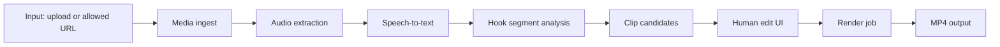

# 프로젝트 워크플로우

## 0. 원칙

이 프로젝트는 "완전 자동 쇼츠 공장"이 아니라 "AI가 후보를 만들고 사람이 빠르게 검수/편집하는 제작 도구"로 시작한다. 이렇게 잡아야 품질, 저작권, 플랫폼 정책, 비용 리스크를 동시에 관리할 수 있다.

## 1. 사용자 워크플로우

1. 사용자가 영상 파일을 업로드하거나 허용된 URL을 입력한다.
2. 시스템이 영상 메타데이터를 확인하고 사용자에게 분석 시작을 묻는다.
3. 백엔드가 원본 영상을 저장하고 오디오를 추출한다.
4. Whisper가 타임스탬프 포함 자막을 만든다.
5. LLM이 자막을 분석해 후킹 구간 후보 3~6개를 만든다.
6. 후보 목록에 제목, 길이, 추천 이유, 해시태그를 표시한다.
7. 사용자가 후보를 선택하고 시작/끝 지점, 제목, 자막, 디자인을 조정한다.
8. 렌더링 작업을 실행한다.
9. FFmpeg가 쇼츠 MP4를 생성한다.
10. 사용자가 MP4를 다운로드한다.

## 2. 시스템 파이프라인



## 3. AI 분석 프롬프트 기준

LLM은 다음 기준으로 후보를 골라야 한다.

- 첫 1~3초에 호기심이 생기는 문장인가
- 독립된 짧은 영상으로 봐도 맥락이 유지되는가
- 정보, 반전, 고백, 숫자, 갈등, 실수, 노하우 중 하나가 있는가
- 15~60초 안에 하나의 완결된 메시지가 있는가
- 원본 발화가 자막으로 보기에 자연스러운가
- 과장/허위 제목으로 이어질 위험이 낮은가

후보 출력 스키마:

```json
{
  "clips": [
    {
      "start_sec": 83.2,
      "end_sec": 124.8,
      "title": "롱폼을 쇼츠로 바꾸는 AI 툴",
      "reason": "URL 입력만으로 후보 구간, 제목, 자막을 자동 생성한다는 기능 소개가 명확하다.",
      "hashtags": ["#유튜브쇼츠", "#AI툴", "#영상편집"],
      "confidence": 0.84
    }
  ]
}
```

## 4. 기술 스택 제안

- Frontend: Next.js, React, Tailwind CSS
- Backend API: Next.js Route Handlers 또는 FastAPI
- Job Queue: BullMQ + Redis 또는 Celery + Redis
- Media Processing: FFmpeg
- STT: OpenAI Whisper API 또는 faster-whisper
- LLM: OpenAI API 또는 Anthropic API
- Storage: local disk for prototype, S3/R2 for production
- Database: SQLite for prototype, Postgres for production

## 5. 마일스톤

### M1: 분석 가능한 프로토타입

- 파일 업로드
- FFmpeg 오디오 추출
- Whisper 전사
- LLM 후보 구간 생성
- 후보 JSON 저장

완료 기준: 샘플 영상 1개에서 후보 3개 이상 생성

### M2: 편집 가능한 웹 MVP

- 영상 입력 화면
- 처리 상태 화면
- 후보 카드 목록
- 클립 미리보기
- 시작/끝 시간 조정
- 제목/해시태그 편집

완료 기준: 브라우저에서 후보를 선택하고 수정 가능

### M3: 렌더링 MVP

- 9:16 MP4 렌더링
- 레터박스 템플릿
- 세로 크롭 템플릿
- 제목/채널명 오버레이
- 자막 입히기
- 다운로드

완료 기준: 1080x1920 MP4 정상 다운로드

### M4: 품질 개선

- 세이프존 가이드
- 폰트/색상/위치 조정
- 후보 구간 재분석
- 자막 문장 정리
- 실패 작업 재시도

완료 기준: 비개발자가 1개 영상을 끝까지 처리 가능

## 6. 리스크 관리

- 저작권: 기본 입력은 파일 업로드와 권한 확인 체크박스로 제한한다.
- 비용: 영상 길이 제한, 동시 작업 제한, 생성 파일 만료를 둔다.
- 품질: 모든 AI 후보는 사용자가 검수한 뒤 렌더링한다.
- 성능: 분석/렌더링은 비동기 작업 큐로 분리한다.
- 보안: 업로드 파일 확장자와 MIME을 검증하고, 임시 파일은 만료 삭제한다.
